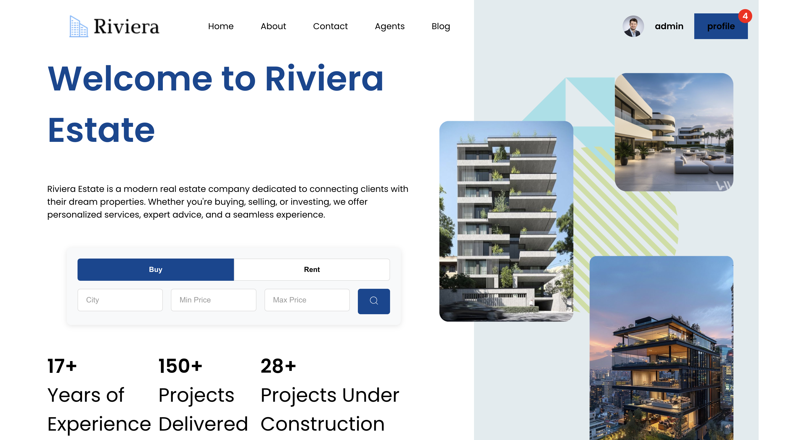
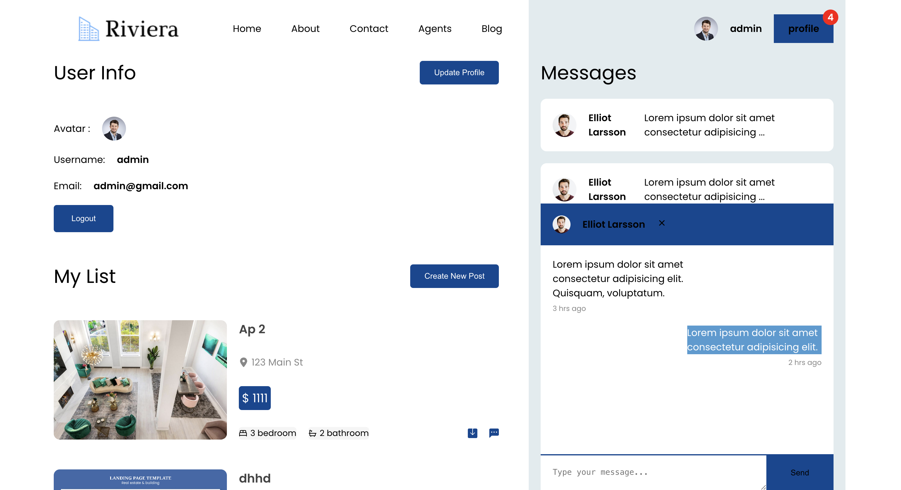
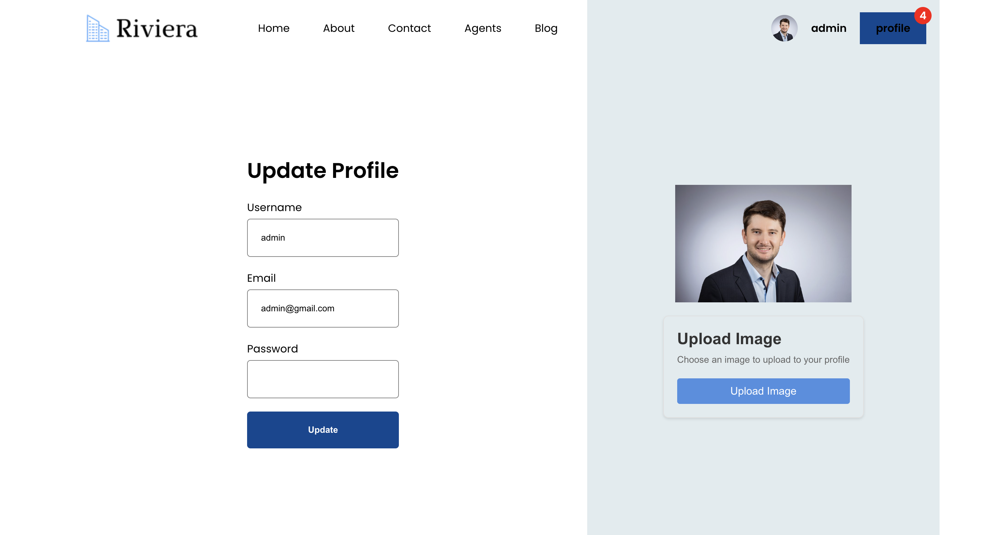
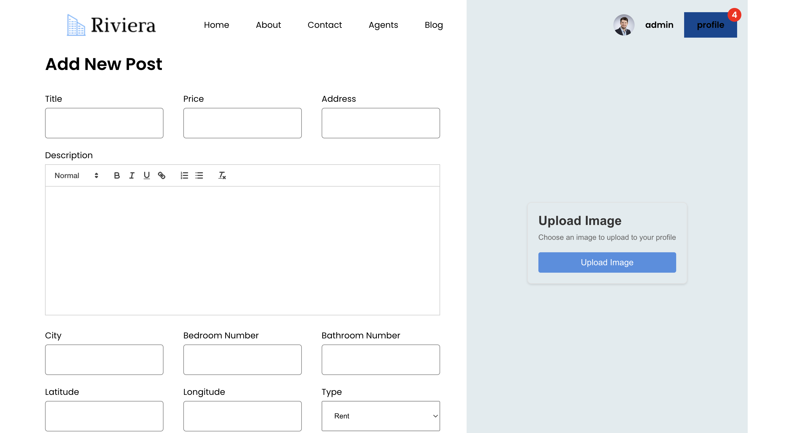

# Riviera: Your Ultimate Property Marketplace

## Home Page

## Profile Page

## Update Profile Page

## Create New Post Page


## Table of Contents
- [Overview](#overview)
- [Features](#features)
- [Tech Stack](#tech-stack)
- [Project Structure](#project-structure)
- [Prerequisites](#prerequisites)
- [Setup and Installation](#setup-and-installation)
- [Usage](#usage)
- [API Endpoints](#api-endpoints)
- [Deployment](#deployment)
- [Contributing](#contributing)
- [License](#license)
- [Contact](#contact)

## Overview

ZA Real Estate is a cutting-edge, full-stack real estate application built by Zakariae Azarkan using the MERN stack (MongoDB, Express.js, React.js, Node.js) with Prisma as the ORM. This platform revolutionizes the way users interact with real estate listings, offering a seamless experience for property browsing, agent communication, and preference management.


## Features

- **User Authentication**: Secure sign-up and login functionality
- **Property Listings**: Comprehensive database of real estate offerings
- **Advanced Search**: Filter properties by location, price, amenities, and more
- **Real-time Chat**: Instant communication between users and agents
- **User Profiles**: Customizable profiles for personalized experiences
- **Favorites and Saved Searches**: Save and track preferred properties
- **Responsive Design**: Optimized for both mobile and desktop viewing
- **Admin Dashboard**: Efficient management of listings and user data
- **Interactive Maps**: Visualize property locations and nearby amenities


## Tech Stack

- **Frontend**: React.js, SASS
- **Backend**: Node.js, Express.js
- **Database**: MongoDB with Prisma ORM
- **Authentication**: JSON Web Tokens (JWT)
- **Real-time Communication**: Socket.io
- **Maps Integration**: Leaflet
- **Cloud Services**: Cloudinary
- **Deployment**: vercel, onrender

## Project Structure

```
za-real-estate/
├── server/
│   ├── controllers/
│   ├── routes/
│   ├── middleware/
│   ├── models/
│   ├── services/
│   └── utils/
├── client/
│   ├── src/
│   │   ├── components/
│   │   ├── pages/
│   │   ├── context/
│   │   ├── hooks/
│   │   ├── styles/
│   │   └── utils/
│   ├── public/
│   └── ...
├── prisma/
├── .gitignore
├── docker-compose.yml
├── package.json
├── README.md
└── ...
```

## Prerequisites

- Node.js (v14 or later)
- MongoDB
- npm or yarn
- Docker (optional, for containerization)

## Setup and Installation

1. Clone the repository:
   ```bash
   git clone https://github.com/zachary013/real-estate-app-mern
   cd za-real-estate
   ```

2. Install dependencies:
   ```bash
   npm install
   cd client && npm install
   ```

3. Set up environment variables:
   Create a `.env` file in the root directory and add necessary variables:
   ```
   DATABASE_URL="your_mongodb_connection_string"
   JWT_SECRET="your_jwt_secret"
   MAPBOX_API_KEY="your_mapbox_api_key"
   AWS_S3_BUCKET="your_s3_bucket_name"
   ```

4. Set up the database:
   ```bash
   npx prisma generate
   npx prisma db push
   ```

5. Start the development servers:
   ```bash
   # In the root directory
   npm run dev
   # In a new terminal, navigate to the client directory
   cd client && npm start
   ```


## Usage

After starting the development servers, you can access:
- The API at `http://localhost:8800`
- The React frontend at `http://localhost:5173`

To use the application:
1. Sign up for an account or log in
2. Browse property listings or use the search feature
3. Save favorite properties and communicate with agents
4. Manage your profile and preferences

## API Endpoints

- `/api/auth` - Authentication routes (login, register, logout)
- `/api/users` - User management (profile, preferences)
- `/api/list` - Property listings (CRUD operations)
- `/api/messages` - Chat functionality
- `/api/search` - Advanced search options

For detailed API documentation, refer to our [API Docs](link-to-api-docs).

## Deployment

1. Build the React frontend:
   ```bash
   cd client && npm run build
   ```

2. Use Docker for easy deployment:
   ```bash
   docker-compose up --build
   ```

3. Deploy to your preferred cloud platform (AWS, Heroku, DigitalOcean, etc.)

## Contributing

We welcome contributions to ZA Real Estate! Please follow these steps:

1. Fork the repository
2. Create a new branch: `git checkout -b feature-branch-name`
3. Make your changes and commit them: `git commit -m 'Add some feature'`
4. Push to the branch: `git push origin feature-branch-name`
5. Submit a pull request

## License

This project is licensed under the MIT License. See the [LICENSE](LICENSE) file for details.

## Contact

Zakariae Azarkan - [azarkanzakariae@email.com](mailto:zakariae.azarkan@email.com)

Project Link: [https://github.com/zachary013/real-estate-app-mern](https://github.com/zachary013/real-estate-app-mern)

---

© 2024 Riviera Estate. All rights reserved.
